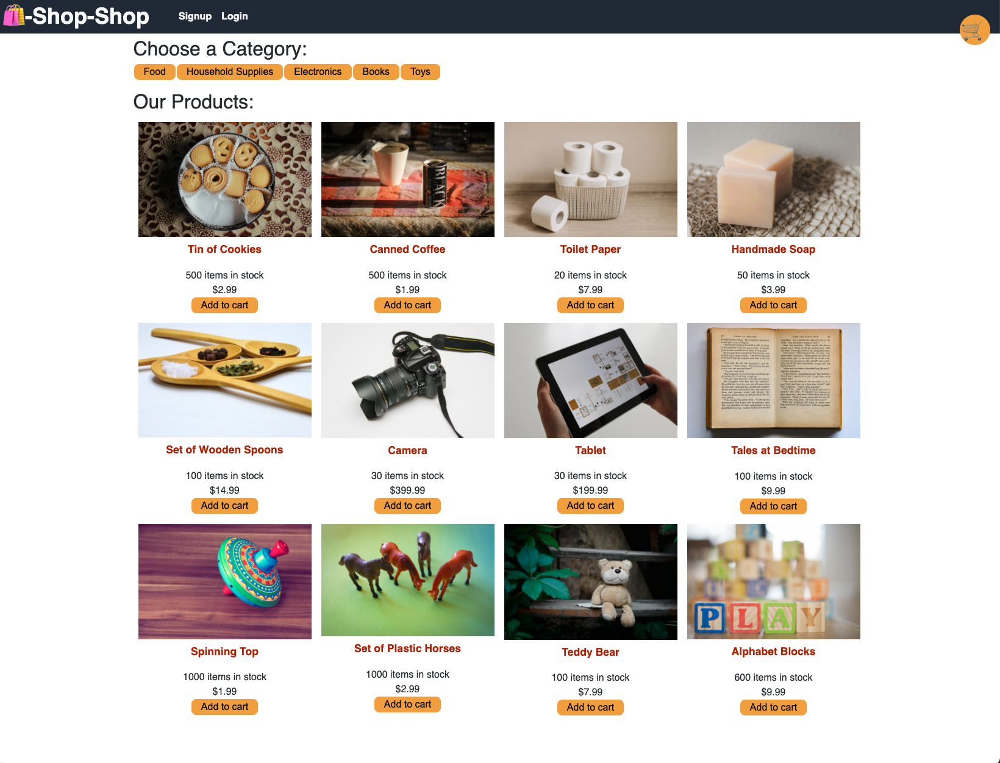

# shop-shop

## Description
This is an e-commerce site. I originally used a context API to manage global state, and then I refactored it to use React Redux to manage global state. I used Stripe to manage payments.

View the app here: [Link to Deployed App](https://ecommerceshopshop.herokuapp.com/).

A preview of the app:

## Table of Contents
* [Installation](#installation)
* [Tests](#tests)
* [Questions](#questions)

## Installation
To install necessary dependencies, run the following command:
npm i

## Tests
To run tests, run the following command: 
npm test

## Questions
If you have any questions about the repo, open an issue or contact me directly on LinkedIn.
You can find more of my work at github.com/suzannaakins.
